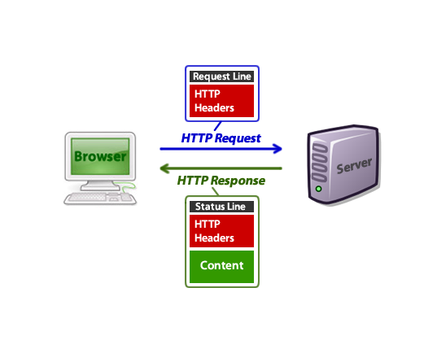

# Facts

- HTTP Headers에 대해서 자세하게 공부했습니다.
- 객체지향 책의 앞부분을 읽었고 객체지향 맛보기 정도 했습니다.

# Finding

## HTTP Headers



- 유저가 주소창에 url을 입력하게 되면 브라우저(크롬)은 서버에 HTTP request를 보냅니다.
  ```java
  GET /tutorials/other/top-20-mysql-best-practices/ HTTP/1.1
  Host: net.tutsplus.com
  User-Agent: Mozilla/5.0 (Windows; U; Windows NT 6.1; en-US; rv:1.9.1.5) Gecko/20091102 Firefox/3.5.5 (.NET CLR 3.5.30729)
  Accept: text/html,application/xhtml+xml,application/xml;q=0.9,*/*;q=0.8
  Accept-Language: en-us,en;q=0.5
  Accept-Encoding: gzip,deflate
  Accept-Charset: ISO-8859-1,utf-8;q=0.7,*;q=0.7
  Keep-Alive: 300
  Connection: keep-alive
  Cookie: PHPSESSID=r2t5uvjq435r4q7ib3vtdjq120
  Pragma: no-cache
  Cache-Control: no-cache
  ```
- 첫번째줄은 요청에 대한 기본적인 정보를 담고 있는 Request Line이고 그 나머지는 HTTP headers 입니다.

- 저 요청 후에, 브라우저는 서버로부터 아래 사진과 같은 HTTP response를 받습니다.

  ```java
  HTTP/1.x 200 OK
  Transfer-Encoding: chunked
  Date: Sat, 28 Nov 2009 04:36:25 GMT
  Server: LiteSpeed
  Connection: close
  X-Powered-By: W3 Total Cache/0.8
  Pragma: public
  Expires: Sat, 28 Nov 2009 05:36:25 GMT
  Etag: "pub1259380237;gz"
  Cache-Control: max-age=3600, public
  Content-Type: text/html; charset=UTF-8
  Last-Modified: Sat, 28 Nov 2009 03:50:37 GMT
  X-Pingback: https://net.tutsplus.com/xmlrpc.php
  Content-Encoding: gzip
  Vary: Accept-Encoding, Cookie, User-Agent

  <!DOCTYPE html PUBLIC "-//W3C//DTD XHTML 1.0 Strict//EN" "http://www.w3.org/TR/xhtml1/DTD/xhtml1-strict.dtd">
  <html xmlns="http://www.w3.org/1999/xhtml">
  <head>
  <meta http-equiv="Content-Type" content="text/html; charset=utf-8" />
  <title>Top 20+ MySQL Best Practices - Nettuts+</title>
  <!-- ... rest of the html ... -->
  ```

- 다른 여러가지들도 많지만 오늘 특히 기억하고 싶은 것은 Http Requests의 헤더에는 Cookie가 있고 Http Response의 헤더에는 Set-Cookie, Location이 있습니다.

## 객체지향

- c++, 자바, C#을 제품으로 본다면 3가지의 개념은 무엇일까? OOP-객체 지향 프로그래밍이다.
- 그렇다면 스프링 프레임워크를 제품으로 보면 그 개념은 뭘까? OOP 프레임워크 입니다. 즉 스프링 프레임워크는 'OOP 프레임워크'라는 개념을 제품화 한 것
- 객체지향은 현실 세계를 구현하기보다는 새로운 세계를 창조한다.
- 낮은 관계의 의존성과 높은 기능의 집중도
- 객체지향 소프트웨어의 객체 = 현실 세계의 사물 특성 + 주도성
- 객체에 주도성이 더 주어질수록 객체 관계를 최대한 단순하게 만들 수 있다.
  - 객체가 주도적일 경우 객체가 해야 할 일(책임)의 처리 방법(메소드 안의 로직)을 변경해도 외부 객체는 영향을 받지 않는다.
  - 주도성을 가진다는 것은 객체가 자신의 상태와 행동을 스스로 관리하는 것

# Feelings

- 여러번 봐도 명확하지 않았던 헤더의 개념을 정리해서 좋았습니다.
- 객체지향의 중요성을 배웠습니다. 객체지향을 빨리 알고 싶습니다!
