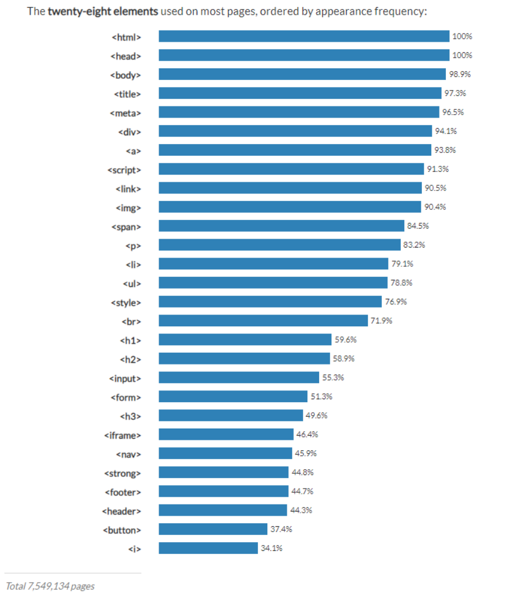
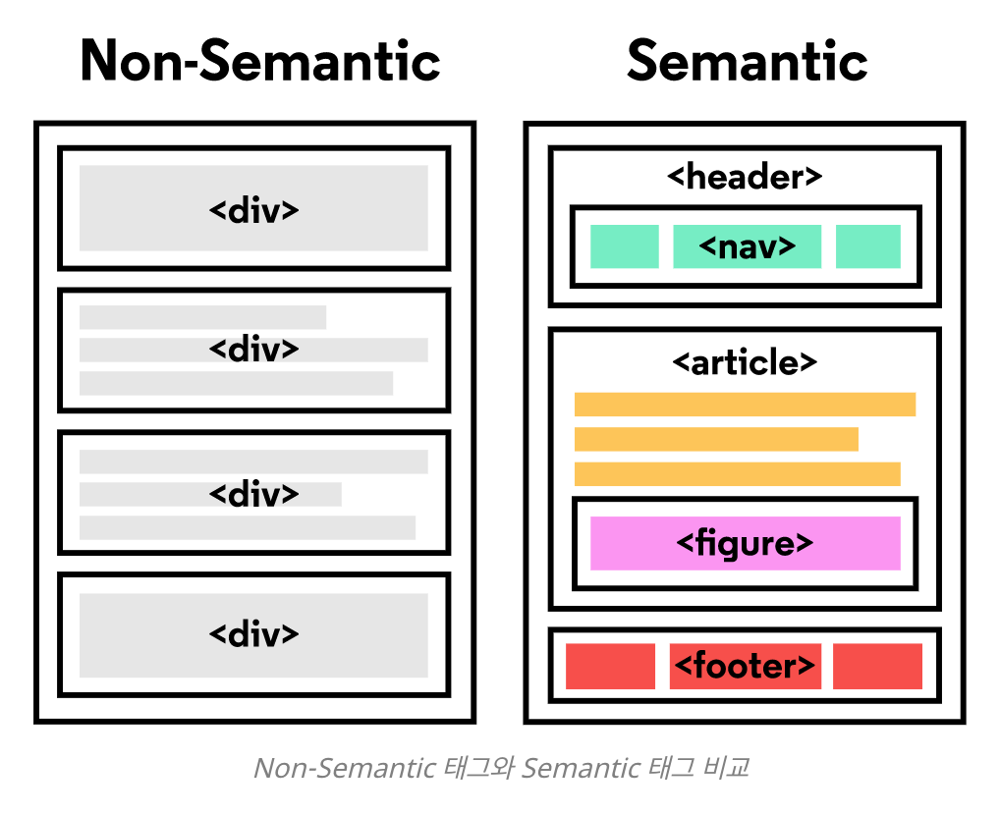

# Facts

- HTML 재정리

# Finding

- HTML이란? (Hyper Text Markup Language) : 웹페이지를 만드는 마크업 언어

- HyperText는 기본적으로 다른 페이지로 이동할 수 있는 HyperLink를 지원하도록 설계 되었고 이 덕분에 페이지 안에서 클릭만으로 다른 페이지로의 이동이 가능하게 된다.

- 특정 기능을 지원하는 태그 문법을 사용한다.



## HTML Basic Tags (Useful)

```
<html>

웹페이지의 시작과 끝을 나타낸다.

<head>

웹 페이지의 정보, 문서에서 사용할 외부 파일들을 링크할 때 사용한다.

<body>

브라우저에 실제 표시되는 내용을 담고있다.

<title>

문서의 제목을 나타낸다. 웹브라우저의 제목 표시줄에 표시된다.
보통 제목표시줄이 더 많이 노출되기 때문에 잘 쓰면 좋다.

<meta>

문자 인코딩 및 문서 키워드 요약 정보
<meta name="viewport" content="width=device-width, intitial-scale=1, user-scalable=no, maximum-scale=1, minimum-scale=1">
뷰포트란 화면상에 우리가 작성한 레이아웃이 나오는 전체 영역을 의미. 나중에 반응형 페이지를 위해서 뷰포트 세팅을 해줘야한다.

<div>

아무런 의미가 없는 태그, 어떤 컨텐츠들을 목적에 따라 묶는 용도로 쓴다.

<span>

div와 마찬가지로 아무런 의미가 없는 태그. div와 의 차이는 inline level element이기 때문에 span을 여러개 붙여도 줄바꿈이 되지 않는다.

<a>

anchor, 웹페이지나 외부 사이트 연결
<a href="연결할 링크의 경로">링크이름</a>
하이퍼링크를 사용해서 페이지들간의 이동이 가능하다. 아직 다른페이지 준비가 안되있을 경우 "#"로 표시한다. 특정 id로 이동하는 앵커 역할도 할 수 있다.

<script>

코드 삽입. 실행 가능한 코드를 참조하거나 삽입할 때 사용, 보통 자바스크립트 코드를 넣을 때 사용한다.
<script type="text/JavaScript">
  document.write("자바스크립트 코드 추가");
</script>

<link>

외부 파일을 연결할 때 사용한다. css나 js 파일을 연결해서 쓴다.
<link rel="stylesheet" type="text/css" href="index.css"/>


이미지 삽입, 웹페이지에 이미지를 넣을 때 사용한다.

<p>

단락, 사용하면 내용 앞뒤로 빈 줄이 생기면서 단락이 생긴다.

<li>

리스트 항목들을 나타내는데 사용

<ul>

순서가 없는 리스트 항목을 묶음

<ol>

순서가 있는 리스트 항목을 묶음

<style>

head 안에서 스타일 정보를 정의할 때 사용하는 태그

<br>

줄바꿈, 개행.

닫는태그가 필요 없다.

<hn>h1 ~ h6

제목을 나타내는 태그

<input>

form 의 요소중 하나 사용자가 정보를 입력할 때 쓰인다.
<input type="유형" 속성="속성값">

<form>

get, post 방식으로 내용을 전송할 수 있다.

<iframe>

외부 페이지를 삽입할 때 쓴다.
보통 동영상을 삽입하는 용도로 쓴다.
<iframe src="삽입할 페이지 주소" [속성="속성값"]></iframe>
<iframe
        width="560"
        height="315"
        src="http://www.youtube.com/embed/VAoBIpxYfBE"
        frameborder="0"
        allow="autoplay; encrypted-media"
        allowfullscreen>
</iframe>

<strong>

중요한 내용 강조하는 태그

<i>

이탤릭 체

<button>

form 요소 중 하나로 페이지에 버튼을 넣고 form을 전송하거나 reset할 때 사용한다.
type=submit, type=reset이 있다.

```

## HTML Semantic Tags



```
대부분의 구조가 <div> 로만 이루어져 있다면 class, id, css 내용 등을 보고 어떤 역할을 하는 태그인지 유추해야 한다. 이러한 불편함을 개선하기 위해 사람이 이해하기 쉽도록 태그의 이름만 보고도 역할이나 위치를 알수 있도록 만든 태그를 semantic tag라고 한다.

협업의 중요성이 커지면서 코드한줄 한줄에 의미가 드러날 수 있도록 코드를 짜는 것도 개발자의 중요한 덕목이라고 볼 수 있다.

<header>

사이트의 제목과 로고, 검색 창 등이 위치

<nav>

다른 페이지로 갈수 있는 링크들이 위치

<section>

페이지에서 보여주고 싶은 주요 내용들이 위치

<summary>

순수 텍스트, 헤딩 등으로 이루어진 paragraph가 위치

<aside>

본문 외의 내용들이 위치

<footer>

저작권 정보나 제작자 정보가 위치

```

# Feelings

- 사용하지 않아서 까먹고 있었던 HTML을 블로그에 정리함으로써 HTML을 써야할 때, 구글링없이 바로 참고할 수 있는 나만의 자료를 만들어서 좋습니다.
