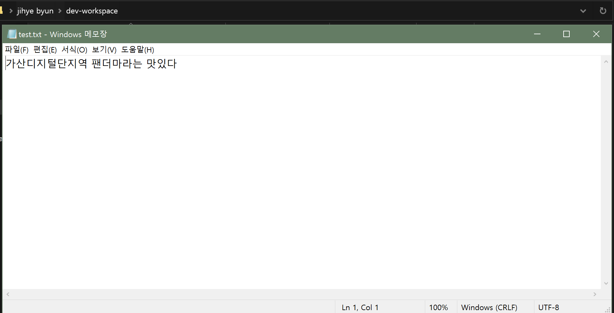

# Facts

- 비동기 프로그래밍에 대해서 공부했습니다.
- 파싱에 대해서 공부했습니다.

# Finding

## 비동기 프로그래밍

---

비동기 프로그래밍은 실제로 어느 서비스에서 이용되는가?
대표적으로 스트리밍 서비스를 제공하는 넷플릭스이다. 넷플릭스 서비스를 만든 후 초창기에는 memory leak, callback hell, error handling 등 비동기 처리때문에 문제가 많았다고 한다. 그런데 2015년 flexible function 으로 약간의 변화를 줬고 많은 문제들이 해결 된 것처럼 보인다. 5년이 지난 2020년 현재는 또 어떤 변화가 넷플릭스에 있는지 궁금하기도 하다. 자세한 건 아직 잘모르겠지만 아래 링크된 영상을 프로그래밍을 좀 더 공부한 후에 보면 느끼는 것도 많고 흥미로울 것 같다.
https://youtu.be/gawmdhCNy-A

```java
내가 오늘 해야 할 일
1. 오후 4시에 은행에서 적금 만들기
2. 마트에서 삼겹살사기

상황
1. 오후 4시는 은행이 바쁜 시간이다. 번호표를 받았지만 내 앞에 이미 많은 사람이 기다리고 있다.
2. 마트는 한가하다.
```

우선 동기적으로 오늘 할 일을 처리하면?

- 오후 4시, 은행에 방문해서 번호표를 받고 그 자리에서 아무것도 하지 않고 하염없이 기다린다.
- 1시간 후 내 차례가 되었고 긴 기다림끝에 적금을 만들었다.
- 마트로 가서 삼겹살을 산다.

  ⇒ 하나의 일이 처리가 끝나야 다른 일로 넘어갈 수 있다.

그리고 비동기적으로 오늘 할 일을 처리하면?

- 은행에 먼저 방문해서 번호표를 받는다.
- 은행에서 내 차례를 기다리지 않고 먼저 마트로 달려가서 삼겹살을 산다.
- 그리고 다시 은행으로 와서 내 순서를 기다리다가 적금을 만든다.

  ⇒어떤 일을 시작하고 끝나지 않아도 다른 일을 시작할 수 있다.

위의 사례를 보면 비동기적처리는 매우 효율적이고 합리적인 방법으로 보이고 동기적 처리는 비효율의 끝을 달리는 것처럼 보인다. 이를 프로그래밍에도 이용하는데 비동기적 프로그래밍은 동기적 프로그래밍과 비교해서 과연 항상 효율적일까? 답은 당연히 그렇지 않다.

동기적 프로그래밍이 필요할 때도 있다. 그때는 바로 순차적인 일을 처리해야만 할 때이다. 또한 간단하게 동기적처리를 할 수 있는데 비동기적 처리를 하게되면 불필요한 낭비가 생길 수 있다.

하지만 프로그래밍에서 비동기적 처리를 하는 것이 더 많은 것처럼 보인다. 비동기 모델은 언제 쓰는게 좋을까? 우선 비동기 모델은 일을 스위칭하는데 낭비되는 시간을 최소화 할 수 있다. 그래서 만약에 애플리케이션이 싱글스레드 환경에서 실행됐을 때, 모든 일이 완료될 때까지 화면은 멈춰버릴 수도 있다. 이를 Bad user experience라고 한다. 그래서 많은 application과 frameworks 들이 비동기모델에 많이 의존하고 있고 자바스크립트같은 경우는 버전이 업데이트될 때마다 비동기 처리에 대한 방식을 업그레이드 해오고 있다.

```java
setTimeout(() => {
	console.log('나는 나중에 실행할거야');
}, 5000);

//타이머는 "적어도" 5초 후에 이벤트큐에 더해질 것이다. 실행되지 않을 수도 있다.
//왜?
//콜스택에 아무것도 없어야 큐에서 콜스택으로 이벤트루프가 던져주는데
//콜스택에 있는 함수가 영영 끝나지 않을 수도 있다.
```

```java
setTimeout(() => {
	console.log('alert창을 꺼야만 내가 실행이 돼')
}; 3000);  //3초후 이벤트큐에 더해진다. 3초 후 실행된다는 의미가 아니다.

setTimeout();
alert('GOOD MORNING!');

//alert 창이 나타났다.
//창을 계속 보기만 하고 'x'를 눌러서 없애지 않는다면?
//콘솔창에서 'alert창을 꺼야만 내가 실행이 돼' 이 문장을 볼 수 없을 것이다.

```

정리하자면, 비동기 프로그래밍이 필요할 때는 특히 웹에서 유저가 기다리는 상황이 만들어질 때이다. 다른 일을 완료할 때까지 유저가 기다려야 한다면 비동기 프로그래밍은 매우 유용할 수 있다. 또한 상황에 따라서 모든 코드를 실행 할 필요가 없을 때도 있다. 이때 비동기적 처리를 필요로 할 것이다. 비동기 프로그래밍이 능사는 아니다.

## 파싱

파싱은 데이터를 핸들링하는 것을 말한다. 이곳 저곳에 있는 데이터를 가져와서 내 입맛에 맞게 바꾸는 것이다. 예를 들어 네이버에 등록된 까페의 정보를 활용해서 어렵지 않게 어플을 만들 수도 있겠다. 위 정보를 활용해서 나한테 꼭 맞는 식당을 찾을 수 있게끔 커뮤니티 기능이 더해진 앱서비스를 만든다고 해보자. 우선 네이버에 등록된 정보를 활용해서 영업시간, 위치에 따라 지금 방문 가능한 식당을 분류할 수 있고 이용자들이 그 식당을 이용하고나서 음식 상태, 맛, 서비스 등의 정보를 추가하고나면 그 이용자들이 만들어낸 정보를 또한 활용할 수 있다. 이 모든 것들이 파싱 과정이라고 할 수 있다. 즉, 내가 필요한 데이터를 핸들링해서 활용하는 것이 파싱이다. 모든 데이터를 맨 땅에 헤딩하는 것처럼 창조할 필요가 없다. 이미 만들어진 방대한 데이터들을 활용하는 것. 이게 바로 파싱을 이용하는 이유이다. 다양한 파싱 기법이 있지만 간단하게 파일 파싱의 예를 들어보겠다.

### 파싱기법 예시

```java
import java.io.FileWriter;
import java.io.IOException;

public class FileWritetest1 {

	public static void main(String[] args)  {

		try {
			FileWriter fw = new FileWriter("c:\\Users\\ji416\\dev-workspace\\test.txt");
			fw.write("가산디지털단지역 ");
			fw.write("팬더마라는 맛있다");
			fw.close();

		} catch (IOException e) {
			// TODO: handle exception
			System.out.println("파일을 쓰다가 에러가 났습니다.");
		}
	}
}

// FileWriter 클래스 이용해서 test.txt 파일 생성한다
// FileWriter 클래스의 write 메소드를 이용해서 텍스트 파일에 글을 적는다.
// FileWriter 클래스의 close 메소드를 이용해서 파일을 닫는다
// try / catch 문으로 예외 처리
```



# Feelings

- 오늘은 자바 웹프로그래밍 Next Step 책으로 아침에 공부하고 그 후에는 그동안 자바를 공부하면서 궁금했던 개념들을 정리하는 시간을 가졌다. 비동기에 대한 개념이 좀 잡힌 기분이다.
- 하고 싶은 공부도 많고, 해야 할 공부도 많다. 앉아있는 시간에는 최대한 집중하고 시간을 잘 활용하자. 꾸준히 하면 된다.
